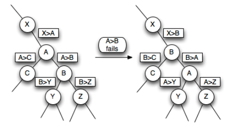

# Kinetic Heap Analysis

## 1. Abstract

A kinetic data structure is a data structure used to track an attribute of a system that is changing continuously as a function of time. So the system has some values, and for each value v, it is known that v=f(t). Kinetic data structures allow queries on a system at the current virtual time t  and two additional operations:

`advance(t)` - Advances the system to time 

`change(v, f(t))`- Alters the trajectory of value

Additional operations may be supported. 
For example, kinetic data structures are often used with a set of points. 
In this case, the structure typically allows points to be inserted and deleted. 
In principle, this can be approximated by sampling the position of the points at fixed intervals 
of time and deleting and re-inserting each point into a "static" (traditional) data structure. 
However, such an approach is vulnerable to oversampling or under-sampling, 
depending on what interval of time is used, and can also be wasteful of computational resources.

Kinetic data structures are frequently used to calculate dynamic geo/spatial configurations like moving points over specific trajectories. However, it applies to everything that can be treated as mutating over time, a classical example is a priority queue with priorities as a function of time. 

## 2. Introduction

There are many scientific researches dedicated to kinetic data structures. 
However, there are a limited number of practical implementations that could serve understanding and learning purposes. 
This article intends to partially fill the gap and to provide a proof of concept of "kinetic heap" implementation.

This approach includes the following steps:

* Review of the certificate-based approach
* Creating  a model  for Kinetic Heap
* Java code design and implementation
* Basic performance tests

What is not included:

* Advanced JMH performance tests, because of a requirement for a very thorough input data preparation. 
This is outside the scope of this article.
* The provided code could be further optimized as we may have alternatives in using relevant data structures 
(certificate Heap vs Binary Search Tree, lazy certificates invalidation vs immediate removal from the heap,  etc....)
* Theoretical `O(N)` notation complexity analysis.
* Observations of other kinetic structures like kinetic tournament, kinetic convex hull, kinetic sorted list, etc...

## 3. Related Works
It is worthy to mention several works:
* Leonidas J Guibas "Kinetic Data Structures" https://graphics.stanford.edu/courses/cs268-16-fall/Notes/g-kds.pdf. It provides a good theoretical problem background for the subject.
* Fairly good Wiki article: https://en.wikipedia.org/wiki/Kinetic_data_structure
* Zahed Rahmati "Simple, Faster Kinetic Data Structures": 
* https://dspace.library.uvic.ca/server/api/core/bitstreams/fc836d25-2016-4d68-b92e-003b95ef608d/content.
It is recommended to read it for better understanding of KDS in geo/space applications.

## 4. Problem Background
Heap is the basic collection structure to effectively perform the following operations:
* `getMin/Max()` - Return a minimum/maximum value  
* `insert(x)` - Insert a value

The time complexity is `O(N*log(N))` because the heap is a complete binary tree with the maximum 
height `log(k)` where `k` is the number of elements. 
It allows duplicates and usually is used as priority queues. The relevant Java class is `PriorityQueue`.

However, what will happen if priorities are mutating as a function of time? 
We will need to add the function:
* `advance(t)` - Advances the system to time `t`

There are a lot of examples, starting from a set of objects having various initial temperatures at 
`0` point of time and heating with different rates. 
Generalizing, the function of a temperature from time could be a non-linear function. 
Alternatively, those could be space coordinates of neighboring points that can intersect at some moment,
so priorities can swap for them at some moment.

A naive approach would be to remove all elements from the heap and insert all of them with new priorities 
at the current moment, thus we will preserve the heep invariant.

An obvious disadvantage of that solution is an increasing time complexity of `advance(t)` operation - `O(N^2)`

We need to design a structure that could mitigate this complexity and be quite close to the 
original logarithmic complexity.


## 5. Architecture of the Application and Implementation of the Solution
### Prerequisites:
* We will be creating min heap
* For simplicity, we will be using a discrete timescale
* We will use a simple kinetic structure - priorities will be the linear function of time and 
initial temperature: `t(x) = t(0) + t * a`, where `a` is the temperature rate, `t(0)` - an initial temperature.
Thus, we will guarantee that a given pair of temperature lines will intersect only once 
(if converging to an intersection point). This point is easy to calculate and exclude from calculations 
once the intersection point is processed.
* We will be using a well-known certificate-based approach. 
Wiki describes this quite well: https://en.wikipedia.org/wiki/Kinetic_heap,
see (<u>Implementation and operations</u>, <u>Dealing with certificate failures</u> section). 
Certificates are just additional components allowing detection of
elements that must be swapped with its root element at a given moment of time and helping to avoid full heap scan.

  

  One can see which certificates one needs to update when the condition A > B fails. 
  This is called a certificate failure (max heap example).

### Implementation steps:
* Let's start from interfaces 
  * <b>Standard heap:</b>

    ```java
    public interface IHeap<T extends Comparable<T>> {
            
      T extractMin();
            
      T getMin();
            
      void insert(T data);
            
      int size();
            
      void clear();
    }
    ```
  
  * <b>Kinetic heap:</b>

    ```java
    public interface IKineticHeap extends IHeap<KineticElement> {
    
      void fastForward(int nextTime);
    
      int getCurTime();
    }
    ```
    
  * <b>Kinetic element.</b> The important attributes are:
  
    `id` - element ID
    
    `initialPriority` - initial priority
    
    `rate` - temperature rate over time 

    ```java
    public class KineticElement implements Comparable<KineticElement> {
    
      private final int id;
      private final double initialPriority;
      private final double rate;
     ...
    
      public double getPriority() {
        return initialPriority + rate * timeSupplier.get();
      }
    ...
      public double getIntersectionTime(KineticElement other) {
        if (rate - other.rate == 0) {
          return Double.NEGATIVE_INFINITY;
        }
        return (other.initialPriority - initialPriority) / (rate - other.rate);
      }
    
      @Override
      public int compareTo(KineticElement other) {
        return Double.compare(getPriority(), other.getPriority());
      }
    ...
    
    }
    ```
    Note, that it is quite easy to calculate intersection time.

  * <b>Certificate</b>:
  
    `elementIdx` - the reference index of a kinetic element

    `expirationTime` - a certificate expiration time

    `ownIdx` - an index of an element in a heap 

    ```java
    public class Certificate implements Comparable<Certificate> {
    
      ...
      private final int elementIdx;
      private final double expirationTime;
    
      @Setter
      private int ownIdx = -1;
    
      @Override
      public int compareTo(Certificate other) {
        return Double.compare(expirationTime, other.expirationTime);
      }
    
      ...
    
    }
    ```

    Note that the heap is an array-based structure, so we will be using index-based access for certificates and elements. 
    Therefore, to effectively remove certificates from the middle of the heap, we need to keep relevant indexes.  

    To make this synchronization easier, the helper `IEventSink` interface is created 
    ```java
    public interface IEventSink<T extends Comparable<T>> {
    
      void onBubbleUpEventBeforeSwap(IHeap<T> heap, int idx, int parentIdx);
    
      void onBubbleUpEventAfterSwap(IHeap<T> heap, int idx, int parentIdx);
    
      void onBubbleUpEventNoChange(IHeap<T> heap, int idx);
    
      void onBubbleDownEventBeforeSwap(IHeap<T> heap, int idx, int parentIdx);
    
      void onBubbleDownEventAfterSwap(IHeap<T> heap, int idx, int parentIdx);
    
      void onBubbleDownEventNoChange(IHeap<T> heap, int idx);
    }
    ```
    It will help to intercept events on bubble up and bubble down events on inserting/removing elements from the heap.

* Concrete implementation

  Further, we will create a standard heap implementation what is of no real interest, see widespread web resources 
  explaining how it works, for example: https://trykv.medium.com/algorithms-on-graphs-the-importance-of-heaps-e3e1385ae534

  Standard heap implementation `Heap` class:
  https://github.com/victor6567758/kinetic/blob/a90490c1196a8503c81faeef859628aa0ec9ce20/src/main/java/org/kinetic/heap/Heap.java

  The core logic of kinetic approach is implemented in `KineticHeap`:
  https://github.com/victor6567758/kinetic/blob/a90490c1196a8503c81faeef859628aa0ec9ce20/src/main/java/org/kinetic/heap/KineticHeap.java

  Those are the key elements:

  `heap` - just the standard heap min heap, contains KineticElement objects.
  
  `certificates` - the min heap containing certificates, so one can extract the soonest certificates which will fail.
  
  `curTime` - this is the current time, it is modified per each call of fastForward (see `advance(x)`).
  
  Note, that each heap element contains a certificate describing the relation between itself and the root element.

  ```java
  Certificate cert  = heap.getValue(idx).getCertificate();
  ```
  
  ```java
  public class KineticHeap implements IKineticHeap {
  
    private final Heap<KineticElement> heap = new Heap<>(null);
  
    private final Heap<Certificate> certificates = new Heap<>(new CertificateEventSink());
  
    private int curTime;
    ...
  ```

  Let's review `fastForward` function:
  It extracts the nearest certificate, then it invalidates up to 5 certificates around, make 
  relevant elements swap (we have monotonically increasing priorities, so the child bubbles down), 
  then inserts up to 4 certificates, as we don't need to update the certificate pointing the parent element 
  (we are already done with this). Note that we use a current certificate time when inserting new ones 
  to avoid generation of already processed certificates.
  This logic, probably, can be done better as to avoid possible edge conditions. 

  ```java
  @Override
    public void fastForward(int nextTime) {
      if (nextTime <= curTime) {
        return;
      }
  
      curTime = nextTime;
  
      while (true) {
  
        Certificate minCertificate = certificates.getMin();
        if (minCertificate == null || certificates.getMin().getExpirationTime() > nextTime) {
          break;
        }
  
        Certificate certificate = certificates.getMin();
  
        if (certificate.getOwnIdx() == -1) {
          throw new IllegalArgumentException();
        }
  
        int elemIdx = certificate.getElementIdx();
        int parentIdx = Heap.getParent(elemIdx);
        invalidateCertificates(elemIdx, parentIdx);
  
        heap.swap(elemIdx, parentIdx);
  
        insertCertificates(elemIdx, certificate.getExpirationTime());
  
      }
    }
  ```

  Let's review bubble up/down functions. This is quite a standard implementation, 
  we just care about certificates invalidation if this is a non-root element 
  (the root can't keep a certificate) and inserting new certificates if the one we are processing 
  exceeds curTime. If no swap occurred, we are just inserting the only one certificate for the current index, 
  because we don't need to invalidate other ones.
  ```java
  private int heapUp() {
      int curIndex = heap.size() - 1;
      while (curIndex > Heap.getRoot()) {
        int parentIndex = Heap.getParent(curIndex);
        if (heap.getValue(curIndex).compareTo(heap.getValue(parentIndex)) < 0) {
          if (curIndex != 0) {
            invalidateCertificates(curIndex, parentIndex);
          }
  
          heap.swap(curIndex, parentIndex);
          insertCertificates(curIndex, curTime);
  
        } else {
          break;
        }
  
        curIndex = parentIndex;
      }
  
      if (curIndex == heap.size() - 1) {
        createAndMaybeAddCertificate(curIndex, curTime);
      }
      return curIndex;
    }
  ```

  That's also a standard implementation. If no swap occurred, we don't do anything 
  as we always start from the root.
  ```java
  private int heapDown() {
      int curIndex = 0;
      int size = heap.size();
      while (true) {
        int leftChildIndex = Heap.getLeftChild(curIndex);
        int rightChildIndex = Heap.getRightChild(curIndex);
        if (leftChildIndex >= size) {
          break;
        }
  
        boolean hasRight = rightChildIndex < size;
        int smallestChildIndex =
            hasRight && heap.getValue(rightChildIndex).compareTo(heap.getValue(leftChildIndex)) < 0
                ? rightChildIndex : leftChildIndex;
  
        if (heap.getValue(smallestChildIndex).compareTo(heap.getValue(curIndex)) < 0) {
          invalidateCertificates(smallestChildIndex, curIndex);
          heap.swap(smallestChildIndex, curIndex);
          insertCertificates(smallestChildIndex, curTime);
        } else {
          break;
        }
        curIndex = smallestChildIndex;
      }
  
      return curIndex;
    }
  ```

  Let's look at `extractMin`/`insert` methods.
  Because we do not remove from the middle, there is bubbling up or down.
  Remember to invalidate a relevant certificate before removing the last element.

  ```java
    @Override
    public KineticElement extractMin() {
      KineticElement minElement = getMin();
  
      if (minElement != null) {
        int lastIdx = heap.size() - 1;
  
        heap.getValue(lastIdx).invalidateCertificate(certificates);
        KineticElement old = heap.setValue(heap.getValue(lastIdx), 0);
        heap.remove(heap.size() - 1);
  
        heapDown();
        return old;
      }
  
      return null;
    }
  ```

  ```java
    @Override
    public void insert(KineticElement data) {
      if (data == null) {
        throw new IllegalArgumentException("Invalid data");
      }
      heap.appendValue(data);
      heapUp();
    }
  ```

  The code what keeps the `certificates` heap invariants and makes them referencing 
  correct indexes in the certificate heap: 
  ```java
  private final Heap<Certificate> certificates = new Heap<>(new CertificateEventSink());
  ...
  
  private class CertificateEventSink implements IEventSink<Certificate> {
  
      @Override
      public void onBubbleUpEventBeforeSwap(IHeap<Certificate> heap, int idx, int parentIdx) {
  
      }
  
      @Override
      public void onBubbleUpEventAfterSwap(IHeap<Certificate> heap, int idx, int parentIdx) {
        setCertificateIndex(idx);
        setCertificateIndex(parentIdx);
      }
  
  
      @Override
      public void onBubbleDownEventBeforeSwap(IHeap<Certificate> heap, int idx, int parentIdx) {
  
      }
  
      @Override
      public void onBubbleDownEventAfterSwap(IHeap<Certificate> heap, int idx, int parentIdx) {
        setCertificateIndex(idx);
        setCertificateIndex(parentIdx);
      }
  
      @Override
      public void onBubbleUpEventNoChange(IHeap<Certificate> heap, int idx) {
        setCertificateIndex(idx);
      }
  
      @Override
      public void onBubbleDownEventNoChange(IHeap<Certificate> heap, int idx) {
        setCertificateIndex(idx);
      }
    }
  ...
  
  private void setCertificateIndex(int idx) {
    if (idx < certificates.size()) {
      Certificate certificate = certificates.getValue(idx);
      certificate.setOwnIdx(idx);
    }
  }
  
  ```

## 6.  Performance Evaluation


The detailed performance testing is outside the scope of this article.

It is essential to keep in mind those metrics must be observed:

* <b>Responsiveness</b>: A kinetic heap is responsive, since each certificate failure causes impacted 
keys to be swapped and leads to only a few certificates being replaced in the worst case.

* <b>Locality</b>: Each node is present in one certificate each along with its parent node and 
two child nodes (if present), meaning that each node can be involved in a total of three 
scheduled events in the worst case, thus kinetic heaps are local.

* <b>Compactness</b>: Each edge in the heap corresponds to exactly one scheduled event, 
therefore the number of scheduled events is exactly `n-1`, where `n` is the number of nodes 
in the kinetic heap. Thus, kinetic heaps are compact.

* <b>Efficiency</b>: Note that as per https://en.wikipedia.org/wiki/Kinetic_heap 
(<u>Analysis of efficiency</u>) the analysis is quite complex, but it is quite efficient
when the number of certificates failures is rather small comparing to the number of elements. 
This condition is not fulfilled in my tests as I generated elements randomly.
However, we still see performance gains compared to the trivial implementation:
The micro-benchmarking was performed with JMH library, `SingleShotTime` mode 
because of the tests were quite computationally heavy  


| Benchmark                                             |                                       (maxTimeSteps)|    (n)|  Mode|  Cnt| Score  | Error | Units |
|-------------------------------------------------------|----|----|----|----|--------|-|-------|
| KineticHeapBenchmark.kineticHeapAddTimeForward        |             100|     10|    ss|        | 0.146  | | ms/op |
| KineticHeapBenchmark.kineticHeapAddTimeForward        |             100|    100|    ss|        | 0.383  | | ms/op |
| KineticHeapBenchmark.kineticHeapAddTimeForward        |             100|   1000|    ss|        | 1.764  | | ms/op |
| <b>KineticHeapBenchmark.kineticHeapAddTimeForward</b> |             100|  10000|    ss|        | 8.198  | | ms/op |
| KineticHeapBenchmark.kineticHeapInserts               |                    100|     10|    ss|        | 0.075  | | ms/op |
| KineticHeapBenchmark.kineticHeapInserts               |                    100|    100|    ss|        | 0.229  | |ms/op 
| KineticHeapBenchmark.kineticHeapInserts               |                    100|   1000|    ss|        | 0.837  | |ms/op 
| KineticHeapBenchmark.kineticHeapInserts               |                    100|  10000|    ss|        | 4.618  | |ms/op 
| KineticHeapBenchmark.kineticHeapRemoves               |                    100|     10|    ss|        | 0.215  | |ms/op 
| KineticHeapBenchmark.kineticHeapRemoves               |                    100|    100|    ss|        | 0.483  | |ms/op 
| KineticHeapBenchmark.kineticHeapRemoves               |                    100|   1000|    ss|        | 7.558  | |ms/op 
| KineticHeapBenchmark.kineticHeapRemoves               |                    100|  10000|    ss|       | 50.519 | |ms/op 
| KineticHeapBenchmark.trivialHeapAddTimeForward        |             100|     10|    ss|        | 1.233  | |ms/op 
| KineticHeapBenchmark.trivialHeapAddTimeForward        |             100|    100|    ss|        | 1.666  | |ms/op 
| KineticHeapBenchmark.trivialHeapAddTimeForward        |             100|   1000|    ss|        | 3.034  | |ms/op 
| <b>KineticHeapBenchmark.trivialHeapAddTimeForward</b> |             100|  10000|    ss|       | 18.022 | |ms/op 
| KineticHeapBenchmark.trivialHeapInserts               |                    100|     10|    ss|        | 0.025  | |ms/op 
| KineticHeapBenchmark.trivialHeapInserts               |                    100|    100|    ss|        | 0.046  | |ms/op 
| KineticHeapBenchmark.trivialHeapInserts               |                    100|   1000|    ss|        | 0.186  | |ms/op 
| KineticHeapBenchmark.trivialHeapInserts               |                    100|  10000|    ss|        | 0.850  | |ms/op 
| KineticHeapBenchmark.trivialHeapRemoves               |                    100|     10|    ss|        | 0.035  | |ms/op 
| KineticHeapBenchmark.trivialHeapRemoves               |                    100|    100|    ss|        | 0.245  | |ms/op 
| KineticHeapBenchmark.trivialHeapRemoves               |                    100|   1000|    ss|        | 0.363  | |ms/op 
| KineticHeapBenchmark.trivialHeapRemoves               |                    100|  10000|    ss|        | 2.379  | |ms/op 

You can look at `testExample` folder to see a visual representation of the heap and 
what happens with certificates when we are forwarding time. 

## 6. References
- https://medium.com/@hasithalgamge/unit-testing-part-4-performance-based-unit-test-af83ce6a3966
- https://trykv.medium.com/algorithms-on-graphs-the-importance-of-heaps-e3e1385ae534
- https://medium.com/@gavinleegoodship23/implementing-kinetic-data-structures-in-python-managing-real-time-data-c6b107c4debc
- https://en.wikipedia.org/wiki/Kinetic_heap
- https://graphics.stanford.edu/courses/cs268-16-fall/Notes/g-kds.pdf
- https://github.com/6851-2021/kinetic
- https://github.com/frankfarrell/kds4j
- https://dspace.library.uvic.ca/server/api/core/bitstreams/fc836d25-2016-4d68-b92e-003b95ef608d/content
- https://www.baeldung.com/cs/heap-vs-binary-search-tree#:~:text=The%20Heap%20differs%20from%20a,as%20an%20array%20of%20numbers.
